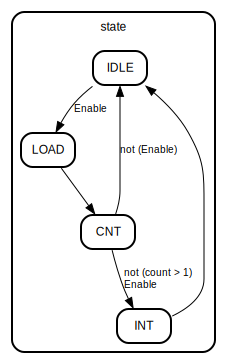

# P7 CPU设计文档

## 思考题

**1 请查阅相关资料，说明鼠标和键盘的输入信号是如何被 CPU 知晓的？**

鼠标和键盘等输入设备检测到输入之后，会向CPU发送一个带有“能够指示进行了何种输入”的输入码的中断信号，同时CPU也支持不止一种中断信号。遇到某种外设对应的中断信号后，CPU会类似我们在P7中进行的，从中断控制器处接收到一个中断信号，执行这种外设对应的中断响应程序，然后进行相关操作。

**2 请思考为什么我们的 CPU 处理中断异常必须是已经指定好的地址？如果你的 CPU 支持用户自定义入口地址，即处理中断异常的程序由用户提供，其还能提供我们所希望的功能吗？如果可以，请说明这样可能会出现什么问题？否则举例说明。（假设用户提供的中断处理程序合法）**

我们选用指定好的地址可以便于同学们的实现。如果支持自定义入口地址，那么入口地址必须要有一个位置存放，这个位置要么是寄存器要么是内存，然后通过修改指定的寄存器值或内存值来支持自定义入口地址。如果假设用户的中断处理程序合法，这样设计应当是可以的。考虑到运行速度问题，不讨论入口地址放在内存中的情况。如果入口地址在寄存器中存放，需要妥善考虑写入该寄存器的流水级，如果在靠前的流水级，可能会增加阻塞数量降低运行效率，或出现“应该先中断后写入变成先写入后中断”的情况导致中断进入的指令位置错误，如果在靠后的流水级（W级），可能会出现“写入自定义入口地址的指令的下一条指令处触发了异常”时还没来得及写入入口地址就中断的情况。

**3 为何与外设通信需要 Bridge？**

因为外设数量在实际应用情况中往往是可变的，即使对于主板来说接口数量固定，但CPU需要适配多种不同配置的主板，因此CPU需要适配不同数量外设，这种情况下必须要系统桥来完成中间的联络，否则就只能写死CPU能支持多少个何种样子的外设，或增加许多不必要的处理。

**4、请阅读官方提供的定时器源代码，阐述两种中断模式的异同，并分别针对每一种模式绘制状态移图。**

根据官方代码，两种模式下的状态转移均为下图。其中区别在于，第一种是在进入INT和从INT进入IDLE（进入时会讲Enable=0）直到IDLE时Enable=1为止，IRQ均置高，第二种则是只有在INT时IRQ置高。

**5 倘若中断信号流入的时候，在检测宏观 PC 的一级如果是一条空泡（你的 CPU 该级所有信息均为空）指令，此时会发生什么问题？在此例基础上请思考：在 P7 中，清空流水线产生的空泡指令应该保留原指令的哪些信息？**

会导致如果在这个空泡处发生外部中断，写入的EPC和BD信号都会变成0（或者空泡设定的任何默认值），中断返回的位置就错了。所以需要对空泡保留其**下一条**指令的EPC和BD信号。

**6、为什么 `jalr` 指令为什么不能写成 `jalr $31, $31`？**

本指令在P6及之前是没有问题的。

但是英文指令集中有规定，jalr的rd和rs不能相等，因为相等的话，如果在jalr的下一条（延迟槽中）指令处产生了中断或异常，jalr的写入已经完成，此时返回到jalr这里重新运行的时候会导致jalr跳转到错误的地址，因此会导致问题。

## 顶层模块

### Entity: mips 

- **File**: mips.v
#### Diagram

#### Ports

| Port name      | Direction | Type   | Description        |
| -------------- | --------- | ------ | ------------------ |
| clk            | input     |        | 时钟信号           |
| reset          | input     |        | 重置信号           |
| interrupt      | input     |        | 中断信号           |
| macroscopic_pc | output    | [31:0] | 宏观PC             |
| i_inst_addr    | output    | [31:0] | 指令地址           |
| i_inst_rdata   | input     | [31:0] | 指令读取结果       |
| m_data_addr    | output    | [31:0] | DM地址             |
| m_data_rdata   | input     | [31:0] | DM读取结果         |
| m_data_wdata   | output    | [31:0] | DM写入内容         |
| m_data_byteen  | output    | [3 :0] | DM字节使能         |
| m_int_addr     | output    | [31:0] | 中断发生器地址     |
| m_int_byteen   | output    | [3 :0] | 中断发生器字节使能 |
| m_inst_addr    | output    | [31:0] | M级PC              |
| w_grf_we       | output    |        | GRF写入使能        |
| w_grf_addr     | output    | [4 :0] | GRF写入地址        |
| w_grf_wdata    | output    | [31:0] | GRF写入数据        |
| w_inst_addr    | output    | [31:0] | W级PC              |
#### Instantiations

- cpu_inst: cpu
- bridge_inst: bridge
- TC0: timer
- TC1: timer

## 模块概述-P7新增

### Entity: bridge 

- **File**: bridge.v
#### Diagram

#### Ports

| Port name | Direction | Type   | Description        |
| --------- | --------- | ------ | ------------------ |
| CPUAddr   | input     | [31:0] | CPU访问地址        |
| CPUByteEn | input     | [3:0]  | CPU字节使能        |
| DMData    | input     | [31:0] | DM数据             |
| TC0Data   | input     | [31:0] | TC0读取数据        |
| TC1Data   | input     | [31:0] | TC1读取数据        |
| DMAddr    | output    | [31:0] | DM地址             |
| DMByteEn  | output    | [3:0]  | DM字节使能         |
| TC0Addr   | output    | [31:2] | TC0地址            |
| TC0WE     | output    |        | TC0写入使能        |
| TC1Addr   | output    | [31:2] | TC1地址            |
| TC1WE     | output    |        | TC1写入使能        |
| INTAddr   | output    | [31:0] | 中断发生器地址     |
| INTByteEn | output    | [3:0]  | 中断发生器字节使能 |
| CPUData   | output    | [31:0] | CPU读取到的数据    |

### Entity: cp0 

- **File**: cp0.v
#### Diagram

#### Ports

| Port name       | Direction | Type   | Description                      |
| --------------- | --------- | ------ | -------------------------------- |
| clk             | input     |        | 时钟信号                         |
| reset           | input     |        | 重置信号                         |
| WE              | input     |        | 写入使能                         |
| cp0Addr         | input     | [4:0]  | 写入地址                         |
| cp0WriteData    | input     | [31:0] | 写入数据                         |
| VPC             | input     | [31:0] | 受害PC                           |
| isInDelayedSlot | input     |        | 当前指令是否在延迟槽             |
| exceptionCode   | input     | [4:0]  | 当前指令错误码（非零时抛出异常） |
| HWInt           | input     | [5:0]  | 中断信号                         |
| EXLClr          | input     |        | 清空信号                         |
| cp0ReadData     | output    | [31:0] | 读取数据                         |
| EPCData         | output    | [31:0] | EPC数据                          |
| requestInt      | output    |        | 中断/异常发生信号                |
#### Signals

| Name  | Type       | Description |
| ----- | ---------- | ----------- |
| SR    | reg [31:0] |             |
| Cause | reg [31:0] |             |
| EPC   | reg [31:0] |             |
#### Processes
- unnamed: ( @(posedge clk) )
  - **Type:** always
- unnamed: ( @(posedge clk) )
  - **Type:** always

### Entity: timer 

- **File**: timer.v
#### Diagram

#### Ports

| Port name | Direction | Type   | Description |
| --------- | --------- | ------ | ----------- |
| clk       | input     |        |             |
| reset     | input     |        |             |
| Addr      | input     | [31:2] |             |
| WE        | input     |        |             |
| Din       | input     | [31:0] |             |
| Dout      | output    | [31:0] |             |
| IRQ       | output    |        |             |
#### Signals

| Name  | Type        | Description |
| ----- | ----------- | ----------- |
| state | reg [1:0]   |             |
| mem   | reg [31:0]  |             |
| _IRQ  | reg         |             |
| load  | wire [31:0] |             |
| i     | integer     |             |
#### Processes
- unnamed: ( @(posedge clk) )
  - **Type:** always
## 模块概述-包装后的CPU

### Entity: cpu 

- **File**: cpu.v
#### Diagram

#### Ports

| Port name     | Direction | Type   | Description      |
| ------------- | --------- | ------ | ---------------- |
| clk           | input     |        | 时钟信号         |
| reset         | input     |        | 重置信号         |
| Inst          | input     | [31:0] | 当前读取到的指令 |
| CPUDataIn     | input     | [31:0] | 读取到的数据     |
| HWInt         | input     | [5:0]  | 中断信号         |
| InstAddr      | output    | [31:0] | 指令地址         |
| CPUDataAddr   | output    | [31:0] | 数据地址         |
| CPUWriteData  | output    | [31:0] | 写入数据内容     |
| CPUDataByteEn | output    | [3:0]  | 写入数据字节使能 |
| requestInt    | output    |        | 中断/异常请求    |
| PCM           | output    | [31:0] | M级PC            |
| RegWrite      | output    |        | GRF写使能        |
| RegAddr       | output    | [4:0]  | GRF写地址        |
| RegData       | output    | [31:0] | GRF写数据        |
| PCW           | output    | [31:0] | W级PC            |
| MacroPC       | output    | [31:0] | 宏观PC           |
#### 

#### Processes
- unnamed: ( @(posedge clk) )
  - **Type:** always
#### Instantiations

- InstructionFetchUnit: ifu
- Controller: control
- RegisterFetch2Decode: rfd
- GeneralRegisterFile: grf
- CompareUnit: cmp
- ExtendUnit: ext
- RegisterDecode2Execute: rde
- ALUSrcALUSrcBMUXE: mux32D2S
- MNDUsageExeResultEMUXE: mux32D3S
- ArthmeticLogicUnit: alu
- MultiplyAndDiviseUnit: mnd
- RegisterExecute2Memory: rem
- DataMemoryInputOutput: dmio
- CoProcessor0: cp0
- RegisterMemory2Writeback: rmw
- RegDataSrcRegDataMUXW: mux32D3S
- RegDataSrcMRegDataMMUXW: mux32D3S
- HazardHandlingModule: hh
