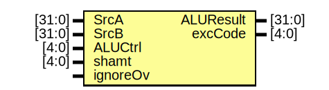

# Entity: alu 

- **File**: alu.v
## Diagram

## Ports

| Port name | Direction | Type   | Description |
| --------- | --------- | ------ | ----------- |
| SrcA      | input     | [31:0] |             |
| SrcB      | input     | [31:0] |             |
| ALUCtrl   | input     | [4:0]  |             |
| shamt     | input     | [4:0]  |             |
| ignoreOv  | input     |        |             |
| ALUResult | output    | [31:0] |             |
| excCode   | output    | [4:0]  |             |
## Signals

| Name        | Type        | Description |
| ----------- | ----------- | ----------- |
| AddResult   | wire [32:0] |             |
| SubResult   | wire [32:0] |             |
| AddOverflow | wire        |             |
| SubOverflow | wire        |             |
