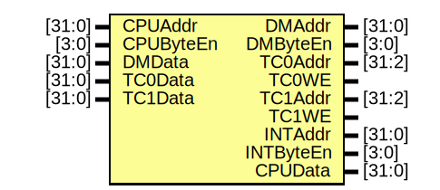

# Entity: bridge 

- **File**: bridge.v
## Diagram

## Ports

| Port name | Direction | Type   | Description |
| --------- | --------- | ------ | ----------- |
| CPUAddr   | input     | [31:0] |             |
| CPUByteEn | input     | [3:0]  |             |
| DMData    | input     | [31:0] |             |
| TC0Data   | input     | [31:0] |             |
| TC1Data   | input     | [31:0] |             |
| DMAddr    | output    | [31:0] |             |
| DMByteEn  | output    | [3:0]  |             |
| TC0Addr   | output    | [31:2] |             |
| TC0WE     | output    |        |             |
| TC1Addr   | output    | [31:2] |             |
| TC1WE     | output    |        |             |
| INTAddr   | output    | [31:0] |             |
| INTByteEn | output    | [3:0]  |             |
| CPUData   | output    | [31:0] |             |
