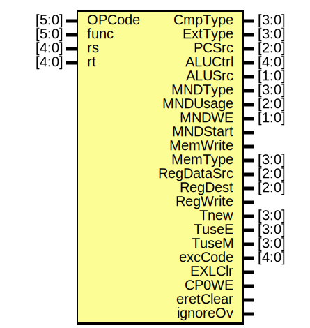

# Entity: control 

- **File**: control.v
## Diagram

## Ports

| Port name  | Direction | Type  | Description |
| ---------- | --------- | ----- | ----------- |
| OPCode     | input     | [5:0] |             |
| func       | input     | [5:0] |             |
| rs         | input     | [4:0] |             |
| rt         | input     | [4:0] |             |
| CmpType    | output    | [3:0] |             |
| ExtType    | output    | [3:0] |             |
| PCSrc      | output    | [2:0] |             |
| ALUCtrl    | output    | [4:0] |             |
| ALUSrc     | output    | [1:0] |             |
| MNDType    | output    | [3:0] |             |
| MNDUsage   | output    | [2:0] |             |
| MNDWE      | output    | [1:0] |             |
| MNDStart   | output    |       |             |
| MemWrite   | output    |       |             |
| MemType    | output    | [3:0] |             |
| RegDataSrc | output    | [2:0] |             |
| RegDest    | output    | [2:0] |             |
| RegWrite   | output    |       |             |
| Tnew       | output    | [3:0] |             |
| TuseE      | output    | [3:0] |             |
| TuseM      | output    | [3:0] |             |
| excCode    | output    | [4:0] |             |
| EXLClr     | output    |       |             |
| CP0WE      | output    |       |             |
| eretClear  | output    |       |             |
| ignoreOv   | output    |       |             |
## Processes
- unnamed: ( @(*) )
  - **Type:** always
