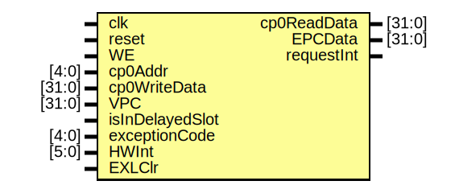

# Entity: cp0 

- **File**: cp0.v
## Diagram

## Ports

| Port name       | Direction | Type   | Description |
| --------------- | --------- | ------ | ----------- |
| clk             | input     |        |             |
| reset           | input     |        |             |
| WE              | input     |        |             |
| cp0Addr         | input     | [4:0]  |             |
| cp0WriteData    | input     | [31:0] |             |
| VPC             | input     | [31:0] |             |
| isInDelayedSlot | input     |        |             |
| exceptionCode   | input     | [4:0]  |             |
| HWInt           | input     | [5:0]  |             |
| EXLClr          | input     |        |             |
| cp0ReadData     | output    | [31:0] |             |
| EPCData         | output    | [31:0] |             |
| requestInt      | output    |        |             |
## Signals

| Name  | Type       | Description |
| ----- | ---------- | ----------- |
| SR    | reg [31:0] |             |
| Cause | reg [31:0] |             |
| EPC   | reg [31:0] |             |
## Processes
- unnamed: ( @(posedge clk) )
  - **Type:** always
- unnamed: ( @(posedge clk) )
  - **Type:** always
