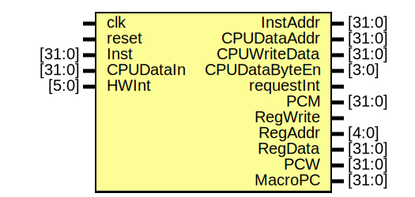

# Entity: cpu 

- **File**: cpu.v
## Diagram

## Ports

| Port name     | Direction | Type   | Description |
| ------------- | --------- | ------ | ----------- |
| clk           | input     |        |             |
| reset         | input     |        |             |
| Inst          | input     | [31:0] |             |
| CPUDataIn     | input     | [31:0] |             |
| HWInt         | input     | [5:0]  |             |
| InstAddr      | output    | [31:0] |             |
| CPUDataAddr   | output    | [31:0] |             |
| CPUWriteData  | output    | [31:0] |             |
| CPUDataByteEn | output    | [3:0]  |             |
| requestInt    | output    |        |             |
| PCM           | output    | [31:0] |             |
| RegWrite      | output    |        |             |
| RegAddr       | output    | [4:0]  |             |
| RegData       | output    | [31:0] |             |
| PCW           | output    | [31:0] |             |
| MacroPC       | output    | [31:0] |             |
## Signals

| Name              | Type        | Description |
| ----------------- | ----------- | ----------- |
| BLANK32           | reg [31:0]  |             |
| BLANK5            | reg [4:0]   |             |
| OPCode            | wire [5:0]  |             |
| func              | wire [5:0]  |             |
| rs                | wire [4:0]  |             |
| rt                | wire [4:0]  |             |
| rd                | wire [4:0]  |             |
| shamtF            | wire [4:0]  |             |
| ImmF              | wire [15:0] |             |
| InstrIndexF       | wire [25:0] |             |
| A1F               | wire [4:0]  |             |
| A2F               | wire [4:0]  |             |
| A3F               | wire [4:0]  |             |
| CmpOut            | wire        |             |
| PCNxtF            | wire [31:0] |             |
| MemWriteF         | wire        |             |
| RegWriteF         | wire        |             |
| MNDStartF         | wire        |             |
| ALUSrcF           | wire [1:0]  |             |
| MNDWEF            | wire [1:0]  |             |
| PCSrcF            | wire [2:0]  |             |
| MNDUsageF         | wire [2:0]  |             |
| RegDestF          | wire [2:0]  |             |
| RegDataSrcF       | wire [2:0]  |             |
| ExtTypeF          | wire [3:0]  |             |
| CmpTypeF          | wire [3:0]  |             |
| TnewF             | wire [3:0]  |             |
| TuseEF            | wire [3:0]  |             |
| TuseMF            | wire [3:0]  |             |
| MemTypeF          | wire [3:0]  |             |
| MNDTypeF          | wire [3:0]  |             |
| ALUCtrlF          | wire [4:0]  |             |
| excCodeF          | wire [4:0]  |             |
| EXLClrF           | wire        |             |
| CP0WEF            | wire        |             |
| eretClearF        | wire        |             |
| ignoreOvF         | wire        |             |
| Froze             | wire        |             |
| RD1ForwardD       | wire [31:0] |             |
| RD2ForwardD       | wire [31:0] |             |
| RD1ForwardE       | wire [31:0] |             |
| RD2ForwardE       | wire [31:0] |             |
| RegDataM          | wire [31:0] |             |
| WDForward         | wire [31:0] |             |
| PCSrcD            | wire [2:0]  |             |
| ImmD              | wire [15:0] |             |
| InstrIndexD       | wire [25:0] |             |
| EPCData           | wire [31:0] |             |
| IFUExcCode        | wire [4:0]  |             |
| NewOPCode         | wire [5:0]  |             |
| NewFunc           | wire [5:0]  |             |
| excCodeFOut       | wire [4:0]  |             |
| MemWriteD         | wire        |             |
| RegWriteD         | wire        |             |
| MNDStartD         | wire        |             |
| ALUSrcD           | wire [1:0]  |             |
| MNDWED            | wire [1:0]  |             |
| MNDUsageD         | wire [2:0]  |             |
| RegDataSrcD       | wire [2:0]  |             |
| ExtTypeD          | wire [3:0]  |             |
| CmpTypeD          | wire [3:0]  |             |
| TnewD             | wire [3:0]  |             |
| TuseED            | wire [3:0]  |             |
| TuseMD            | wire [3:0]  |             |
| MemTypeD          | wire [3:0]  |             |
| MNDTypeD          | wire [3:0]  |             |
| ALUCtrlD          | wire [4:0]  |             |
| excCodeD          | wire [4:0]  |             |
| EXLClrD           | wire        |             |
| CP0WED            | wire        |             |
| eretClearD        | wire        |             |
| ignoreOvD         | wire        |             |
| isIDSD            | wire        |             |
| A1D               | wire [4:0]  |             |
| A2D               | wire [4:0]  |             |
| A3D               | wire [4:0]  |             |
| shamtD            | wire [4:0]  |             |
| PCNxtD            | wire [31:0] |             |
| ImmExt            | wire [31:0] |             |
| RD1D              | wire [31:0] |             |
| RD2D              | wire [31:0] |             |
| MemWriteE         | wire        |             |
| RegWriteE         | wire        |             |
| MNDStartE         | wire        |             |
| ALUSrcE           | wire [1:0]  |             |
| MNDWEE            | wire [1:0]  |             |
| MNDUsageE         | wire [2:0]  |             |
| RegDataSrcE       | wire [2:0]  |             |
| TnewE             | wire [3:0]  |             |
| TuseEE            | wire [3:0]  |             |
| TuseME            | wire [3:0]  |             |
| MemTypeE          | wire [3:0]  |             |
| MNDTypeE          | wire [3:0]  |             |
| ALUCtrlE          | wire [4:0]  |             |
| excCodeE          | wire [4:0]  |             |
| EXLClrE           | wire        |             |
| CP0WEE            | wire        |             |
| ignoreOvE         | wire        |             |
| isIDSF            | wire        |             |
| A1E               | wire [4:0]  |             |
| A2E               | wire [4:0]  |             |
| A3E               | wire [4:0]  |             |
| shamtE            | wire [4:0]  |             |
| RD1E              | wire [31:0] |             |
| RD2E              | wire [31:0] |             |
| PCNxtE            | wire [31:0] |             |
| ImmE              | wire [31:0] |             |
| ALUCalcSrcB       | wire [31:0] |             |
| ALUResultE        | wire [31:0] |             |
| MNDBusyE          | wire        |             |
| MNDLOE            | wire [31:0] |             |
| MNDHIE            | wire [31:0] |             |
| ExeResultE        | wire [31:0] |             |
| ALUOverflowSignal | wire        |             |
| excCodeEOut       | wire [4:0]  |             |
| ALUExcCode        | wire [4:0]  |             |
| MemWriteM         | wire        |             |
| RegWriteM         | wire        |             |
| RegDataSrcM       | wire [2:0]  |             |
| TnewM             | wire [3:0]  |             |
| TuseMM            | wire [3:0]  |             |
| MemTypeM          | wire [3:0]  |             |
| excCodeM          | wire [4:0]  |             |
| EXLClrM           | wire        |             |
| CP0WEM            | wire        |             |
| isIDSM            | wire        |             |
| A1M               | wire [4:0]  |             |
| A2M               | wire [4:0]  |             |
| A3M               | wire [4:0]  |             |
| ExeResultM        | wire [31:0] |             |
| RD2M              | wire [31:0] |             |
| PCNxtM            | wire [31:0] |             |
| DMDataM           | wire [31:0] |             |
| isChangingA3      | wire        |             |
| changedA3         | wire [4:0]  |             |
| A3M_new           | wire [4:0]  |             |
| excCodeMOut       | wire [4:0]  |             |
| DMExcCode         | wire [4:0]  |             |
| CP0ReadDataM      | wire [31:0] |             |
| RegWriteW         | wire        |             |
| RegDataSrcW       | wire [2:0]  |             |
| TnewW             | wire [3:0]  |             |
| A3W               | wire [4:0]  |             |
| ExeResultW        | wire [31:0] |             |
| PCNxtW            | wire [31:0] |             |
| DMDataW           | wire [31:0] |             |
| CP0ReadDataW      | wire [31:0] |             |
| MNDRealBusy       | wire        |             |
## Processes
- unnamed: ( @(posedge clk) )
  - **Type:** always
## Instantiations

- InstructionFetchUnit: ifu
- Controller: control
- RegisterFetch2Decode: rfd
- GeneralRegisterFile: grf
- CompareUnit: cmp
- ExtendUnit: ext
- RegisterDecode2Execute: rde
- ALUSrcALUSrcBMUXE: mux32D2S
- MNDUsageExeResultEMUXE: mux32D3S
- ArthmeticLogicUnit: alu
- MultiplyAndDiviseUnit: mnd
- RegisterExecute2Memory: rem
- DataMemoryInputOutput: dmio
- CoProcessor0: cp0
- RegisterMemory2Writeback: rmw
- RegDataSrcRegDataMUXW: mux32D3S
- RegDataSrcMRegDataMMUXW: mux32D3S
- HazardHandlingModule: hh
