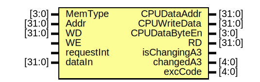

# Entity: dmio 

- **File**: dmio.v
## Diagram

## Ports

| Port name     | Direction | Type   | Description |
| ------------- | --------- | ------ | ----------- |
| MemType       | input     | [3:0]  |             |
| Addr          | input     | [31:0] |             |
| WD            | input     | [31:0] |             |
| WE            | input     |        |             |
| requestInt    | input     |        |             |
| dataIn        | input     | [31:0] |             |
| CPUDataAddr   | output    | [31:0] |             |
| CPUWriteData  | output    | [31:0] |             |
| CPUDataByteEn | output    | [3:0]  |             |
| RD            | output    | [31:0] |             |
| isChangingA3  | output    |        |             |
| changedA3     | output    | [4:0]  |             |
| excCode       | output    | [4:0]  |             |
## Signals

| Name            | Type        | Description |
| --------------- | ----------- | ----------- |
| DM_data_reg     | reg [31:0]  |             |
| halfword_dataIn | wire [15:0] |             |
| byte_dataIn     | wire [7:0]  |             |
