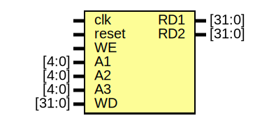

# Entity: grf 

- **File**: grf.v
## Diagram

## Ports

| Port name | Direction | Type   | Description |
| --------- | --------- | ------ | ----------- |
| clk       | input     |        |             |
| reset     | input     |        |             |
| WE        | input     |        |             |
| A1        | input     | [4:0]  |             |
| A2        | input     | [4:0]  |             |
| A3        | input     | [4:0]  |             |
| WD        | input     | [31:0] |             |
| RD1       | output    | [31:0] |             |
| RD2       | output    | [31:0] |             |
## Signals

| Name    | Type       | Description |
| ------- | ---------- | ----------- |
| grf_reg | reg [31:0] |             |
| i       | integer    |             |
## Processes
- unnamed: ( @(posedge clk) )
  - **Type:** always
