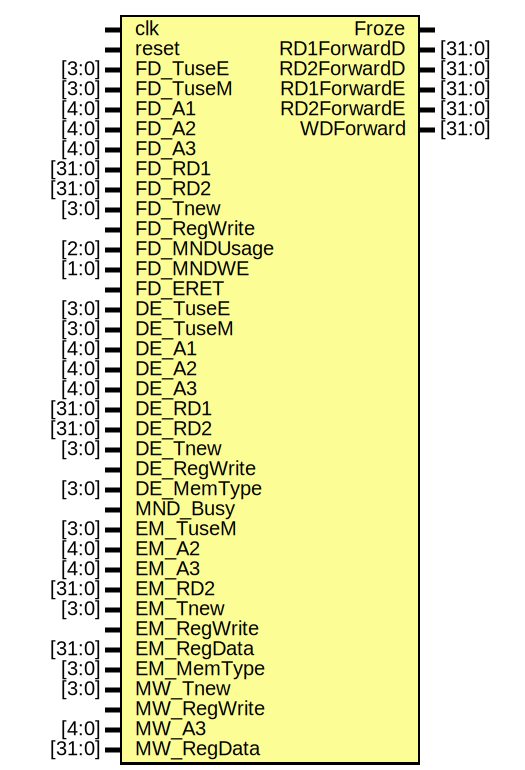

# Entity: hh 

- **File**: hh.v
## Diagram

## Ports

| Port name   | Direction | Type   | Description |
| ----------- | --------- | ------ | ----------- |
| clk         | input     |        |             |
| reset       | input     |        |             |
| FD_TuseE    | input     | [3:0]  |             |
| FD_TuseM    | input     | [3:0]  |             |
| FD_A1       | input     | [4:0]  |             |
| FD_A2       | input     | [4:0]  |             |
| FD_A3       | input     | [4:0]  |             |
| FD_RD1      | input     | [31:0] |             |
| FD_RD2      | input     | [31:0] |             |
| FD_Tnew     | input     | [3:0]  |             |
| FD_RegWrite | input     |        |             |
| FD_MNDUsage | input     | [2:0]  |             |
| FD_MNDWE    | input     | [1:0]  |             |
| FD_ERET     | input     |        |             |
| DE_TuseE    | input     | [3:0]  |             |
| DE_TuseM    | input     | [3:0]  |             |
| DE_A1       | input     | [4:0]  |             |
| DE_A2       | input     | [4:0]  |             |
| DE_A3       | input     | [4:0]  |             |
| DE_RD1      | input     | [31:0] |             |
| DE_RD2      | input     | [31:0] |             |
| DE_Tnew     | input     | [3:0]  |             |
| DE_RegWrite | input     |        |             |
| DE_MemType  | input     | [3:0]  |             |
| MND_Busy    | input     |        |             |
| EM_TuseM    | input     | [3:0]  |             |
| EM_A2       | input     | [4:0]  |             |
| EM_A3       | input     | [4:0]  |             |
| EM_RD2      | input     | [31:0] |             |
| EM_Tnew     | input     | [3:0]  |             |
| EM_RegWrite | input     |        |             |
| EM_RegData  | input     | [31:0] |             |
| EM_MemType  | input     | [3:0]  |             |
| MW_Tnew     | input     | [3:0]  |             |
| MW_RegWrite | input     |        |             |
| MW_A3       | input     | [4:0]  |             |
| MW_RegData  | input     | [31:0] |             |
| Froze       | output    |        |             |
| RD1ForwardD | output    | [31:0] |             |
| RD2ForwardD | output    | [31:0] |             |
| RD1ForwardE | output    | [31:0] |             |
| RD2ForwardE | output    | [31:0] |             |
| WDForward   | output    | [31:0] |             |
## Signals

| Name         | Type      | Description |
| ------------ | --------- | ----------- |
| eretStallCnt | reg [3:0] |             |
## Processes
- unnamed: ( @(posedge clk) )
  - **Type:** always
