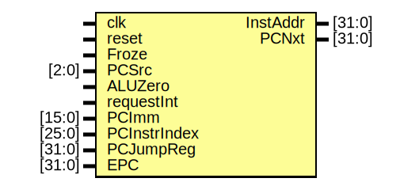

# Entity: ifu 

- **File**: ifu.v
## Diagram

## Ports

| Port name    | Direction | Type   | Description |
| ------------ | --------- | ------ | ----------- |
| clk          | input     |        |             |
| reset        | input     |        |             |
| Froze        | input     |        |             |
| PCSrc        | input     | [2:0]  |             |
| ALUZero      | input     |        |             |
| requestInt   | input     |        |             |
| PCImm        | input     | [15:0] |             |
| PCInstrIndex | input     | [25:0] |             |
| PCJumpReg    | input     | [31:0] |             |
| EPC          | input     | [31:0] |             |
| InstAddr     | output    | [31:0] |             |
| PCNxt        | output    | [31:0] |             |
## Signals

| Name | Type       | Description |
| ---- | ---------- | ----------- |
| PC   | reg [31:0] |             |
## Processes
- unnamed: ( @(posedge clk) )
  - **Type:** always
