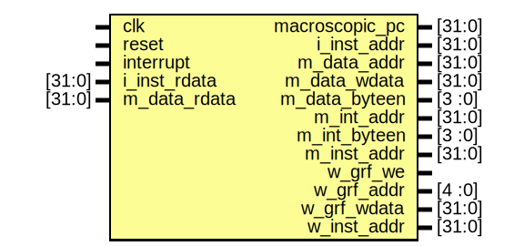

# Entity: mips 

- **File**: mips.v
## Diagram

## Ports

| Port name      | Direction | Type   | Description |
| -------------- | --------- | ------ | ----------- |
| clk            | input     |        |             |
| reset          | input     |        |             |
| interrupt      | input     |        |             |
| macroscopic_pc | output    | [31:0] |             |
| i_inst_addr    | output    | [31:0] |             |
| i_inst_rdata   | input     | [31:0] |             |
| m_data_addr    | output    | [31:0] |             |
| m_data_rdata   | input     | [31:0] |             |
| m_data_wdata   | output    | [31:0] |             |
| m_data_byteen  | output    | [3 :0] |             |
| m_int_addr     | output    | [31:0] |             |
| m_int_byteen   | output    | [3 :0] |             |
| m_inst_addr    | output    | [31:0] |             |
| w_grf_we       | output    |        |             |
| w_grf_addr     | output    | [4 :0] |             |
| w_grf_wdata    | output    | [31:0] |             |
| w_inst_addr    | output    | [31:0] |             |
## Signals

| Name         | Type        | Description |
| ------------ | ----------- | ----------- |
| HWInt        | wire [5:0]  |             |
| requestInt   | wire        |             |
| CPUAddr      | wire [31:0] |             |
| CPUDataIn    | wire [31:0] |             |
| CPUWriteData | wire [31:0] |             |
| CPUByteEn    | wire [3:0]  |             |
| TC0Data      | wire [31:0] |             |
| TC1Data      | wire [31:0] |             |
| TC0Addr      | wire [31:2] |             |
| TC1Addr      | wire [31:2] |             |
| TC0WE        | wire        |             |
| TC1WE        | wire        |             |
| TC0IRQ       | wire        |             |
| TC1IRQ       | wire        |             |
## Instantiations

- cpu_inst: cpu
- bridge_inst: bridge
- TC0: timer
- TC1: timer
