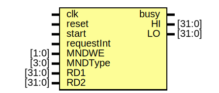

# Entity: mnd 

- **File**: mnd.v
## Diagram

## Ports

| Port name  | Direction | Type   | Description |
| ---------- | --------- | ------ | ----------- |
| clk        | input     |        |             |
| reset      | input     |        |             |
| start      | input     |        |             |
| requestInt | input     |        |             |
| MNDWE      | input     | [1:0]  |             |
| MNDType    | input     | [3:0]  |             |
| RD1        | input     | [31:0] |             |
| RD2        | input     | [31:0] |             |
| busy       | output    |        |             |
| HI         | output    | [31:0] |             |
| LO         | output    | [31:0] |             |
## Signals

| Name    | Type       | Description |
| ------- | ---------- | ----------- |
| curType | reg [1:0]  |             |
| cnt     | reg [3:0]  |             |
| prod    | reg [63:0] |             |
## Processes
- unnamed: ( @(posedge clk) )
  - **Type:** always
- unnamed: ( @(posedge clk) )
  - **Type:** always
